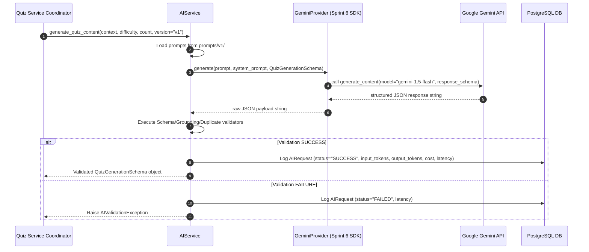

# AI Ingestion Preparation Layer Specification - Sprint 5.5

This document details the vendor-agnostic AI preparation layer designed and implemented during Sprint 5.5 for QuizForge AI.

---

## 1. System Architecture

```text
       [Document Chunks]
               │
               ▼
       [Prompt Manager] <─── compiles ─── [prompts/v1/quiz_generation.txt]
               │
               ▼
       [AIConfig Model] (temperature, top_p, model parameters)
               │
               ▼
       [AI Service Wrapper]
               │
       [BaseAIProvider] ───── calls ─────> [Gemini API / LLM]
               │                                      │
               ▼                                      ▼
    [BaseEvaluator Gate] <─── returns ─── [Raw Response JSON]
         │ (evaluates schema, difficulty, grounding, duplicates)
         ▼
     [Success] ──────> 1. Log AIRequest (tokens, cost, latency, status)
                       2. Return validated Pydantic model to DB commit
```

---

## 2. Directory Structure

The AI module is organized inside its own self-contained feature folder:

```text
backend/app/features/ai/
├── __init__.py      # Exports ai_config and AIService
├── prompts/
│   ├── v1/
│   │   ├── system_prompt.txt       # Base instructions
│   │   ├── quiz_generation.txt     # Ingestion template
│   │   └── difficulty_mapping.txt  # Bloom's difficulty map
│   └── v2/                         # Target experimentation folder
├── providers/
│   ├── __init__.py  # Exports BaseAIProvider
│   └── base.py      # Abstract interface BaseAIProvider
├── evaluators/
│   ├── __init__.py  # Exports evaluators
│   ├── base.py      # BaseEvaluator interface
│   ├── schema_validator.py       # JSON schema gate
│   ├── grounding_validator.py    # Hallucination gate
│   ├── difficulty_validator.py   # Bloom taxonomy gate
│   └── duplicate_validator.py    # Uniqueness gate
├── config.py        # Centralized AIConfig settings class
├── schemas.py       # Pydantic structured output models
├── models.py        # SQLAlchemy 2.0 AIRequest audit model
├── exceptions.py    # Custom exception classes
└── services.py      # AIService orchestrator coordinating validation pipeline
```

---

## 3. Configuration & Prompt Management

### A. Centralized AIConfig (`config.py`)
All parameters are managed in a single model that reads environment variable overrides prefixed with `AI_` (e.g. `AI_TEMPERATURE`):
* `provider` (default: `"gemini"`)
* `model` (default: `"gemini-1.5-flash"`)
* `temperature` (default: `0.2`)
* `top_p` (default: `0.95`)
* `max_output_tokens` (default: `4096`)
* `timeout` (default: `30.0`)
* `retry_count` (default: `3`)
* `json_mode` (default: `True`)

### B. Prompt Versioning
Prompts are isolated into version-controlled text files within `prompts/v{version}/`. 
`AIService.load_prompt` compiles templates dynamically based on input parameters (e.g. `version="v1"`), bypassing hardcoded Python strings.

---

## 4. Quality Validation Gate (Evaluators)

Before committing generated data, the output passes through four evaluation filters:
1. **SchemaValidator**: Confirms that raw JSON parses successfully into Pydantic target structures.
2. **GroundingValidator**: Audits semantic alignment (grounding) against source document context to prevent hallucinations.
3. **DifficultyValidator**: Enforces Bloom's taxonomy mapping based on requested difficulty levels.
4. **DuplicateValidator**: Screens for redundant questions or matching distractor options within questions.

---

## 5. Cost & Latency Auditing (`AIRequest`)
To monitor cost overheads and latency regressions, every generation is recorded in the `ai_requests` table:
* `provider`, `model`, and `prompt_version`
* `input_tokens` and `output_tokens` (pre-calculated using character ratios, to bind to model tokenizers in V2)
* `estimated_cost` (derived dynamically based on input/output pricing configurations)
* `latency_ms` (precise time tracking of API runtime execution)
* `status` (`SUCCESS` or `FAILED`)

---

## 6. Sequence Diagram: Future Gemini API Integration

When we hook up the Google GenAI SDK in Sprint 6, it will interact as follows:



---

## 7. Interview Talking Points & Trade-Offs

* **"Why did you isolate prompts into text files instead of keeping them in python constants?"**
  * *"Hardcoding prompts inside code blocks represents technical debt. By isolating them into versioned directories (`prompts/v1/`, `prompts/v2/`), we can modify prompts, evaluate gains, and run A/B testing safely without changing code statements or risking deployment breaks."*
* **"Explain the provider abstraction design trade-offs."**
  * *"Designing the BaseAIProvider interface adds a small design overhead initially. However, the trade-off pays off because it keeps the application vendor-agnostic. We can swap Google GenAI for OpenAI or Anthropic by simply writing a provider class that implements the interface. The AIService, prompt manager, database schemas, and validators remain untouched."*
* **"Why is the AIRequest audit database necessary?"**
  * *"Production AI systems require cost, speed, and safety monitoring. By logging latency, token counts, and estimated costs into the database, we can identify latency regressions, calculate API bill overheads, and monitor failure rate patterns in real-time."*
