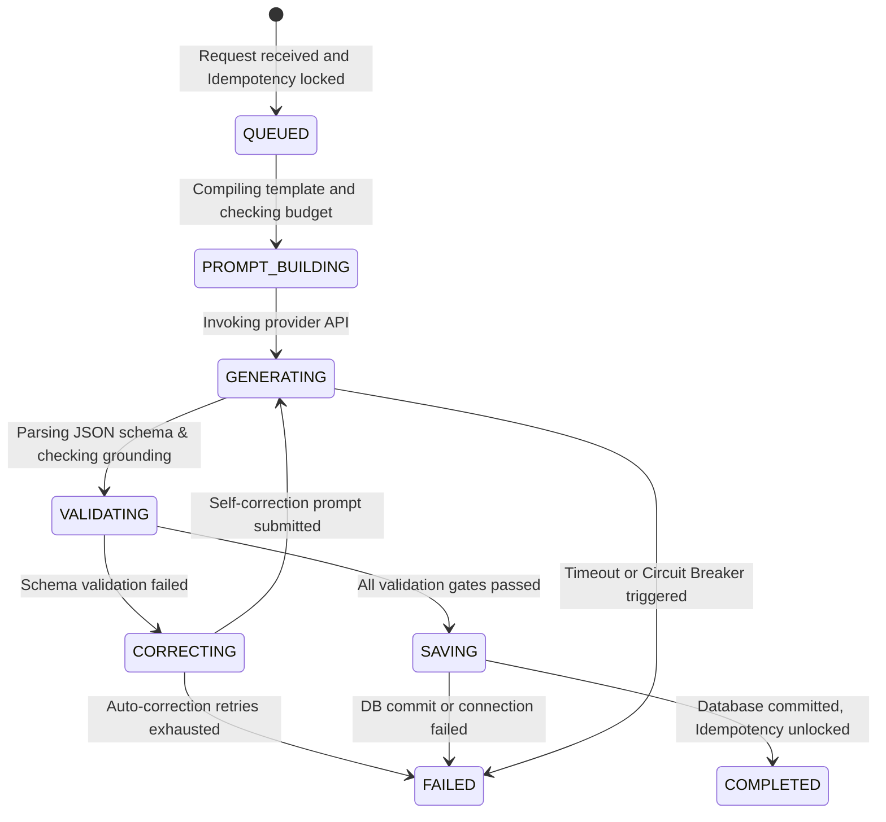
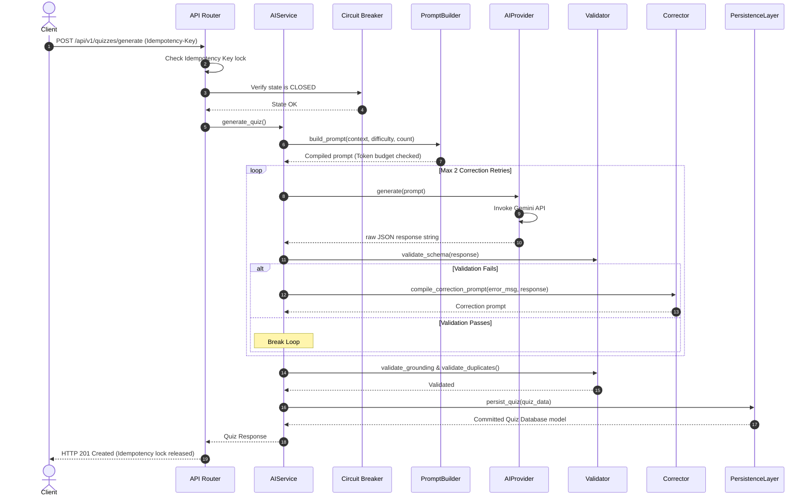

# AI Quiz Generation Specification - Sprint 6

This document details the concrete implementation, state transitions, quality checks, and database commits implemented during Sprint 6.

---

## 1. System Ingestion & Orchestration Architecture

```text
Incoming POST Request (Idempotency Key & JSON parameters)
        │
        ├── [Idempotency Guard] ──── (Key exists) ───> Return cached response/running status
        │
        ├── [Circuit Breaker] ────── (Status: OPEN) ──> Return HTTP 503 Service Unavailable
        │
        ├── [Token Budget Guard] ─── (Tokens > Limit) ──> Trim/chunk context
        │
        ├── [Prompt Builder] ──────────> Compile System & User templates
        │
        ├── [AI Config Limit Check] ──> Enforces spending limits (max_cost, max_retries)
        │
        ├── [AI Provider (Gemini)] ───> Sends prompt (Leverages Prompt Context Cache)
        │
        ├── [Safety Validation Gate] ── (Violates Policy) ──> Return Policy Violation Error
        │
        ├── [BaseEvaluator Validator]
        │         ├── SchemaValidator ── (Fail) ──> [Corrector Retry Loop] (Max 2)
        │         ├── GroundingValidator
        │         ├── DifficultyValidator
        │         └── DuplicateValidator
        │
        └── [Persistence Layer] ──> DB Commit (Quiz, Questions, Options, AIRequest)
```

---

## 2. Ingestion Progress & LifeCycle State Machine

To monitor the generation progress in real-time, the quiz goes through the following states:



---

## 3. Concrete Folder Structure

The AI Quiz Generation code is structured under a dedicated features folder:

```text
backend/app/features/ai/
├── __init__.py      # Exports config and AIService
├── builders.py      # PromptBuilder: System and User templates, Bloom Taxonomy selection
├── config.py        # Centralized AIConfig settings class (spending limits, timeouts)
├── correctors.py    # Self-correction loop error compiler
├── exceptions.py    # Custom AI layer exception classes (AIValidationException, etc.)
├── models.py        # SQLAlchemy 2.0 AIRequest audit model
├── persistence.py   # PersistenceLayer: transactional subtransactions (SAVEPOINTs)
├── router.py        # API Router: POST /api/v1/quizzes/generate
├── schemas.py       # Pydantic schemas: QuizResponse, QuizGenerationSchema, OptionSchema
├── services.py      # AIService orchestrator: manages circuit breakers, token guards, state updates
├── providers/
│   ├── __init__.py  # Exports provider wraps
│   ├── base.py      # Abstract BaseAIProvider interface
│   └── gemini.py    # Concrete GeminiProvider (via google-generativeai SDK)
├── evaluators/
│   ├── __init__.py  # Exports quality evaluators
│   ├── base.py      # Abstract BaseEvaluator interface
│   ├── schema_validator.py       # Pydantic schema validation check
│   ├── grounding_validator.py    # Hallucination checking gate
│   ├── difficulty_validator.py   # Difficulty checks
│   └── duplicate_validator.py    # Collision checking validator
└── prompts/
    ├── v1/
    │   ├── system_prompt.txt
    │   ├── quiz_generation.txt
    │   └── difficulty_mapping.txt
    └── v2/
```

---

## 4. Key Engineering Implementations & Safeguards

### A. Circuit Breaker Strategy
To safeguard backend performance against downstream API outages and rate limits:
* **CLOSED**: Normal generation requests proceed.
* **OPEN**: If 5 failed requests occur within 30s, the circuit breaker trips. Subsequent requests fail fast with `503 Service Unavailable` for a 30s cooldown period to conserve local worker threads.
* **HALF-OPEN**: Once cooldown expires, 1 request is allowed through. If it succeeds, the breaker resets to **CLOSED**; if it fails, it returns to **OPEN**.

### B. Idempotency Key Lock
To block duplicate client request spams:
* The `X-Idempotency-Key` header is checked at the API boundary.
* If an active key is found in the database `Quiz` table:
  * If the status is `COMPLETED` or `READY`, the cached quiz metadata is returned instantly.
  * If the status is `GENERATING` or `QUEUED`, the request immediately fails with a `400 Bad Request` informing that generation is already active.

### C. Context Caching & Cost Optimization
* We pass Pydantic models directly as Gemini's `response_schema`, forcing the model to generate structured JSON outputs.
* Prompt layouts are structured to keep static files prefix (large document context text) in place, allowing Gemini to leverage cached context tokens, reducing billing costs by up to 90% for subsequent requests on the same file.

---

## 5. Sequence Diagram



---

## 6. Interview Talking Points

* **"How do you optimize costs when generating multiple quizzes on the same file?"**
  * *"We structure our prompts to put the document context first and configuration variables at the end. By keeping the static document context prefix unchanged, Google Gemini automatically caches the processed tokens. Subsequent quiz generations on the same file leverage this context cache, reducing input billing rates by 90%."*
* **"Explain the self-correction feedback loop design."**
  * *"If the raw JSON fails Pydantic schema parsing, our Corrector gathers the specific validation error traces and appends them to a correction prompt. The model receives a correction report alongside its previous invalid payload, allowing it to self-heal and return compliant JSON on the next retry. This increases generation reliability."*
* **"Why did you use nested subtransactions (begin_nested) for persistence?"**
  * *"We save the Quiz root, Questions, and Options within a single database transaction block. If an insert fails (e.g. key collision or connection drop), the entire subtransaction rolls back, preventing the user database from becoming polluted with corrupted or orphaned quiz rows."*
