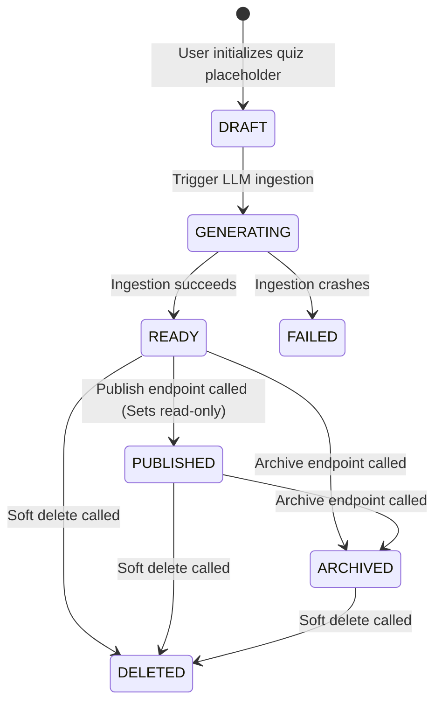
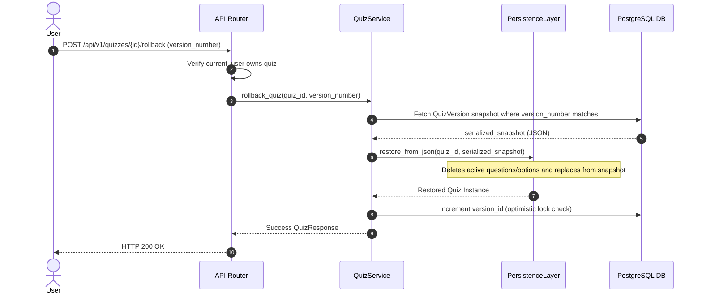

# Quiz Management & Auditing Specification - Sprint 7

This document details the concrete implementation, state transitions, version snapshots, transaction outbox, and pagination queries implemented during Sprint 7.

---

## 1. System Ingestion & Versioning Architecture

```text
User Request (Modify Quiz / Publish / Rollback)
        │
        ├── [Row-Level Auth Check] ──── (User not owner/admin) ───> HTTP 403 Forbidden
        │
        ├── [Lifecycle State check] ─── (State is PUBLISHED) ────> Block edits
        │
        ├── [Optimistic Lock Check] ─── (version_id mismatch) ────> Raise StaleDataError
        │
        ├── [DB Mutates in Nested Subtransaction]
        │         ├── Apply field changes (e.g. title)
        │         ├── Save Edit Audits in QuizEditHistory
        │         ├── Serialize & Write JSON snapshot in QuizVersion
        │         └── Insert domain event in OutboxEvent
        │
        └── DB Commit & Releases Connection (HTTP 200/204 Success)
```

---

## 2. Progress & Lifecycle State Machine

To monitor states and block illegal operations (e.g. editing published questions):



---

## 3. Transactional Outbox Pattern

To avoid temporal coupling with message brokers, we implement the Outbox pattern:
1. Business writes (editing or publishing) are wrapped in the same database transaction as the `outbox_events` table writes.
2. If database write fails, the outbox event is rolled back. If it succeeds, the event is saved as `PENDING`.
3. Background publisher workers query `PENDING` outbox events asynchronously, dispatch them to Redis Streams/RabbitMQ/WebSockets, and flag them as `COMPLETED`.

Supported events:
* `QuizPublished`
* `QuizArchived`
* `QuizRegenerated`
* `QuizRolledBack`

---

## 4. Extended Version Snapshot (`QuizVersion`)

Rather than storing relational diff deltas (Question/Option history tables), O(1) snapshots are stored in the `quiz_versions` JSON column:
* `version_number` and `reason` (educator notes).
* `source` (origins: `AI`, `MANUAL`, or `ROLLBACK`).
* `published_from_version` (snapshot pointer when published).
* `ai_request_id` (foreign key connecting LLM costs).

---

## 5. Sequence Diagram: Snapshot Rollback



---

## 6. Interview Talking Points

* **"Why choose O(1) JSON snapshots over relational delta diff storage?"**
  * *"Delta storage (diff tracks) consumes minimal storage but requires a chain of computations to restore historical version states. Snapshotting serialize the entire entity tree (Quiz + Questions + Options) into a JSON column. This makes restores an O(1) read-write operation, simplifying system logic and increasing DB reliability."*
* **"Why optimistic locking instead of pessimistic locks?"**
  * *"Pessimistic locking locks rows in the database, blocking other readers. This hurts concurrency in high-traffic web applications. Optimistic locking uses a version column check on write. If another process updated the quiz in the meantime, the save fails immediately, protecting data integrity without holding database lock threads."*
* **"How does the Outbox Pattern ensure reliability?"**
  * *"Microservices cannot safely commit DB updates and publish message broker events atomically in one go. If the broker is offline, database writes roll back, or the event is lost. By saving events in the local database transaction first (Outbox), we guarantee that the event is recorded. Background workers poll and dispatch it with an at-least-once guarantee."*
