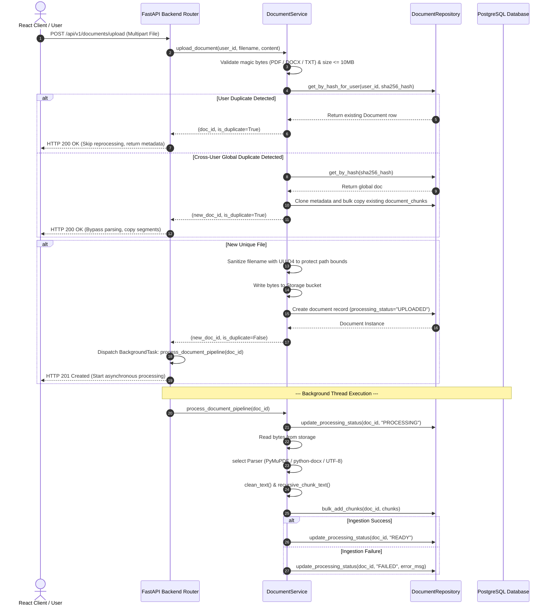

# Document Ingestion Pipeline Specification - Sprint 5

This document details the architecture, sequence flows, safety checks, and chunk segmenting methods designed and implemented during Sprint 5 for QuizForge AI.

---

## 1. Pipeline Architecture

```text
User Request (Multipart Upload)
        │
        ├── [Validation Gate] ── (Size > 10MB or Unrecognized magic bytes) ──> HTTP 400 Bad Request
        │
        ├── [Deduplication Strategy]
        │         ├── Duplicate for same User: returns existing Doc metadata (HTTP 200 OK)
        │         └── Cross-User Duplicate: clones metadata, copies DB chunks, returns (HTTP 200 OK)
        │
        ├── [Physical Storage Save]
        │         └── Replaces file name with user_id/document_id.ext to block path traversal
        │
        ├── [DB Meta Creation] -> Sets upload_status="SUCCESS", processing_status="UPLOADED"
        │
        ├── [Client Response] -> Returns HTTP 201 Created (New file uploaded successfully)
        │
        └── [Asynchronous Hand-off] -> Dispatches FastAPI BackgroundTasks to parse and segment
```

---

## 2. Processing Pipeline Sequence Diagram



---

## 3. Folder Structure

The ingestion pipeline is organized as a self-contained feature module:

```text
backend/app/features/document/
├── __init__.py      # Exports document_router
├── router.py        # Endpoints: upload, listing, details, deletion
├── service.py       # Core service pipeline (deduplication, storage routes, tasks)
├── repository.py    # Database read/writes for Document and DocumentChunk
├── schemas.py       # Pydantic schemas and ProcessingStatus enum
├── dependencies.py  # FastAPI Depends injectors
├── models.py        # SQLAlchemy 2.0 schemas for documents & document_chunks
├── parser.py        # Isolated parsers (PyMuPDF, python-docx, TXT)
├── chunking.py      # Recursive splits & character size control
└── validators.py    # Magic bytes, SHA-256 fingerprinting, name sanitization
```

---

## 4. Key Engineering Decisions & Security Safeguards

### A. Defensive MIME type Checking (Magic Bytes)
To prevent malicious file uploads (e.g. executable shells or scripts disguised as `.txt` or `.pdf`), the server does not rely on client-supplied headers. We read the initial bytes of the stream:
* **PDF**: Must begin with `b"%PDF"`
* **DOCX**: Must begin with standard ZIP header `b"PK\x03\x04"`
* **TXT**: Must resolve to a valid UTF-8 character decode pass.

### B. Deduplication & Privacy-Safe Copying
If User B uploads a file identical to a file already processed for User A:
1. The backend detects identical SHA-256 hash signatures.
2. It reuses the storage file path rather than duplicating cloud storage allocations.
3. It copies the `document_chunks` records in the database to User B's ownership boundaries.
4. *Rationale*: If User A deletes their document, User B's copy remains completely active and uncorrupted, maintaining multi-tenant database isolation.

### C. Downstream RAG-Ready Chunks
Clean text blocks are recursively segmented (default size: 2000 chars, overlap: 200 chars). Chunks are indexed and stored in `document_chunks` table, preparing the database for future vectorized semantic search capabilities (pgvector/RAG).

---

## 5. Interview Talking Points

* **"How do you secure your file ingestion pipeline?"**
  * *"We enforce three levels of validation: maximum file size caps at the router level, cryptographic SHA-256 signature calculations to identify duplicates, and raw magic-byte header inspections to bypass spoofed client headers."*
* **"Why did you use FastAPI BackgroundTasks instead of Celery for Sprint 5?"**
  * *"For Version 1, we wanted a modular monolith without the deployment complexity of Celery, Redis, or RabbitMQ. We designed the background parser function `process_document_pipeline` to accept only a serializable UUID `document_id`. If we need to scale to standalone Celery tasks in V2, we can swap out BackgroundTasks in the router with `task.delay()` without changing a single line of parser or service logic."*
* **"How does the parsing strategy work?"**
  * *"We use the Strategy pattern to isolate parsing algorithms. PyMuPDF handles PDFs, python-docx parses Microsoft packages, and TXT files decode UTF-8. The service dynamically calls the correct strategy via a parser factory."*
